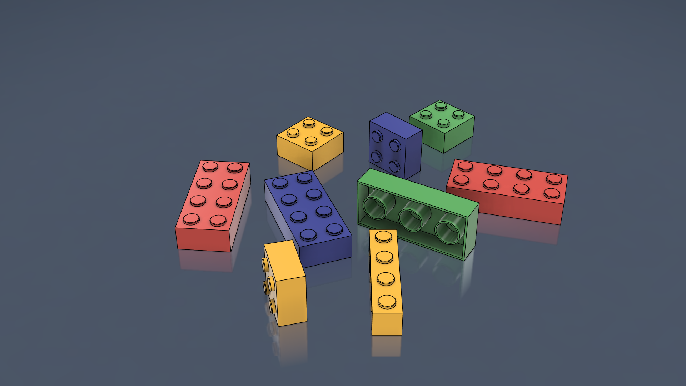
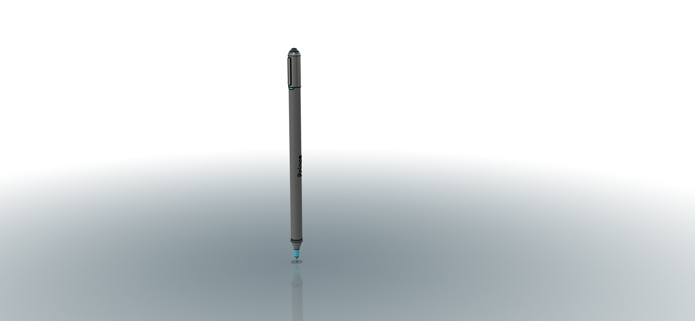
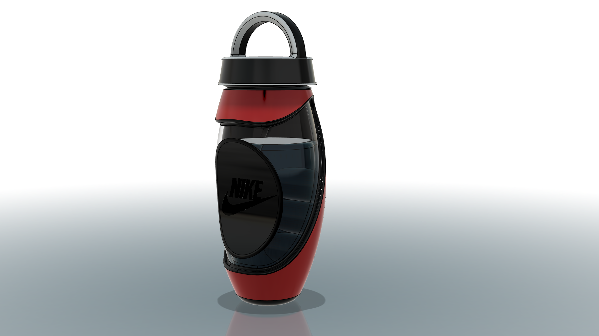
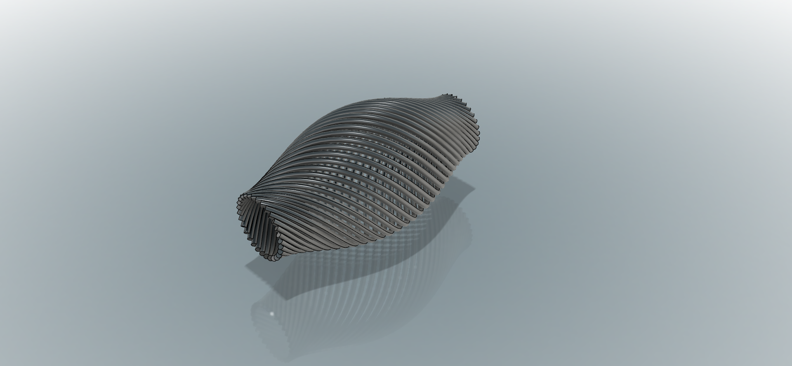

# Master your Skills with Fusion 360 for Aspiring Engineers

**INSTRUCTOR**: Prince Gildas Mbama Kombila

## Table of Contents
1. [Week 1: Beginner Projects (Basic Tools and Rendering)](#week-1-beginner-projects)
2. [Week 2: Intermediate Projects (Sweeps, Lofts, and Threads)](#week-2-intermediate-projects)
3. [Week 3: Advanced Projects (Patterns, Mirroring, Surfaces, and 3D Printing)](#week-3-advanced-projects)
4. [Week 4: Advanced SVG, Image Import, and Form Tools](#week-4-advanced-svg-image-import-and-form-tools)
5. [Key Focus Areas](#key-focus-areas)

---

## Suivez ma playlist YouTube

Découvrez ma série de tutoriels en vidéo pour apprendre Fusion 360 :

## Week 1: Beginner Projects
*Focus on Basic Tools and Rendering*  
**Date**: *09/21/2024*

- **Project 1: Lego**
  - **Tools Covered**: Sketch, Pattern, Fillet, Extrude, Text
  - **Description**: Design a simple Lego using basic sketch and extrude tools.
  

  
- **Project 2: Pencil**
  - **Tools Covered**: Sketch, Revolve, Fillet, Appearance
  - **Description**: Create a pencil using the Revolve tool and apply details such as chamfers or fillets at the tip.
   

- **Project 3: Advanced Bottle with Texture**
  - **Tools Covered**: Sketch, Revolve, Fillet, Shell, Appearance
  - **Description**: Design a symmetrical water bottle with texture using the Revolve tool and add thickness with Shell.
  

---

## Week 2: Intermediate Projects
*Focus on Sweeps, Lofts, and Threads*

- **Project 4: Lounge Chair**
  - **Tools Covered**: Sketch, Sweep, Loft, Fillet, Mirror
  - **Description**: Design a lounge chair with organic curves using Loft and Sweep tools for smooth transitions.

- **Project 5: Spiral Vase**
  - **Tools Covered**: Coil, Thread, Fillet, Shell, Pattern
  - **Description**: Create a spiral vase using the Coil and Thread tools, with decoration using patterns.
    

- **Project 6: Assembly and Animation**
  - **Tools Covered**: Assemble
  - **Description**: Create a joints system and animate it using the Assemble function.

---

## Week 3: Advanced Projects
*Focus on Patterns, Mirroring, Surfaces, 3D Printing, Parametric Design, and Technical Drawing*

- **Project 7: Custom Gear + Servo Motor**
  - **Tools Covered**: Sketch, Extrude, Circular Pattern, Mirror, Thread
  - **Description**: Design a custom gear with detailed patterns and apply thread details. Include assembly and technical drawings.

- **Project 8: Complex Modeling (Bike Frame)**
  - **Tools Covered**: Pipe, 3D Sketch, Combine, Inspect, Construct
  - **Description**: Model a complex surface such as a bike frame using advanced surface modeling tools.

- **Project 9: Threaded Bolt & Nut**
  - **Tools Covered**: Thread, Coil, Technical Drawing
  - **Description**: Create a threaded bolt and nut, and practice technical drawing.

---

## Week 4: Advanced SVG, Image Import, and Form Tools

- **Project 10: Custom Phone Case**
  - **Tools Covered**: SVG Import, Sketch, Extrude, Fillet, Emboss
  - **Description**: Design a custom phone case by importing SVG files and using the Emboss tool to engrave patterns.

- **Project 11: 3D Model from Image Blueprint**
  - **Tools Covered**: Canvas, Sketch, Loft, Sweep, Mirror
  - **Description**: Trace and create a 3D model from an image blueprint.

- **Project 12: Furniture Design Using Forms**
  - **Tools Covered**: Form, Surface Tools, Loft, Sweep, Thicken, Fillet
  - **Description**: Design a complex piece of furniture using organic curves and advanced surface tools.

---

## Key Focus Areas
- **Week 1**: Basic Tools (Sketch, Revolve, Extrude, Mirror)
- **Week 2**: Sweeps, Lofts, Threads, and Pipes, Rendering
- **Week 3**: Advanced Tools (Surface Modeling, Patterns, Mirroring)
- **Week 4**: Advanced Design with Images, SVG Imports, and Forms, STL Exporting
- **Week 5+**: Focus on Animation and Rendering

---
Thanks --------------------------